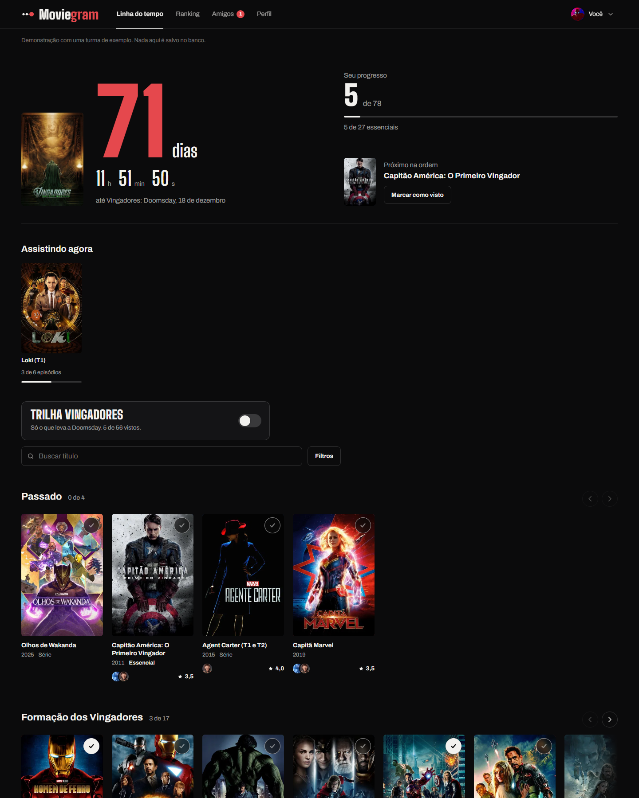
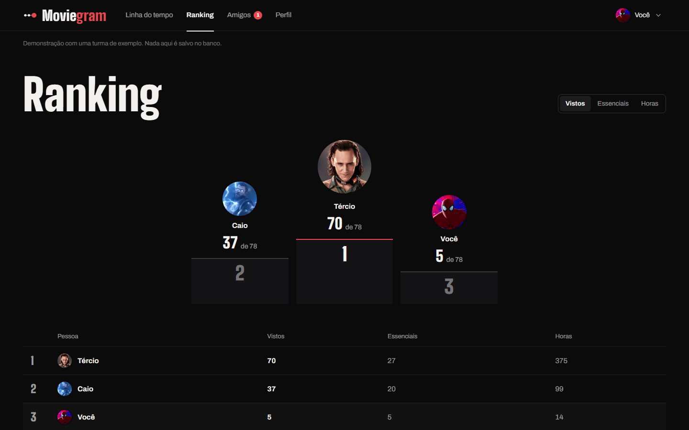
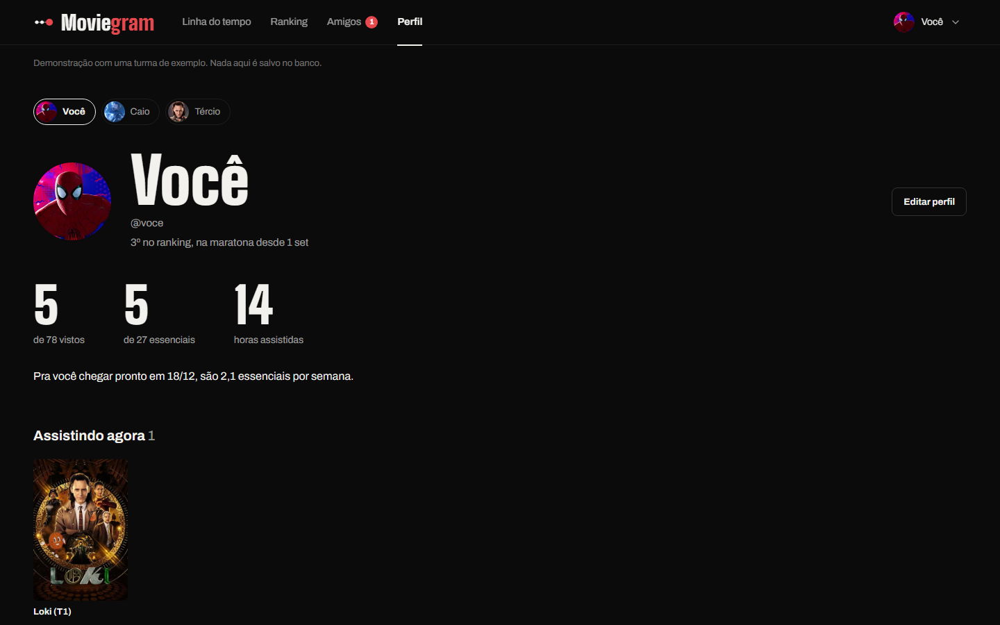
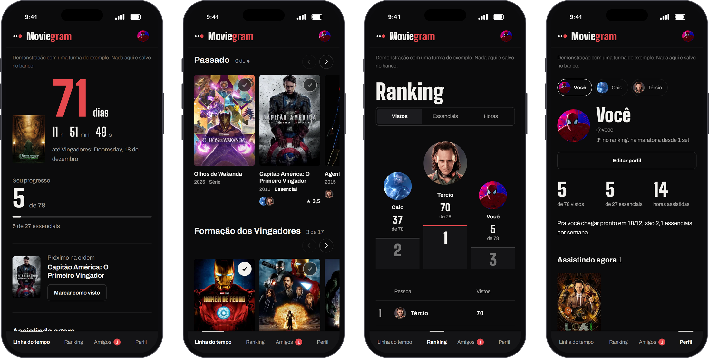

# Moviegram

A linha do tempo inteira da Marvel com a sua turma: cada um marca o que já viu, dá de 1 a 5 estrelas, comenta e acompanha quem chega mais pronto em **Vingadores: Doomsday (18/12/2026)**.

- **Linha do tempo**: ordem cronológica ou de lançamento, em fileiras (horizontal) ou grade (vertical), com filtro por saga.
- **Ranking**: pódio, tabela da turma, favoritos e títulos que dividiram opiniões.
- **Perfil**: seus números, progresso por era, ritmo até Doomsday, favoritos e o que falta.

**[Ver no ar](https://moviegram-chi.vercel.app)**



| Ranking | Perfil |
|---|---|
|  |  |

<p align="center">
  
</p>

<sub>Telas capturadas no modo demonstração, com uma turma de exemplo.</sub>

Feito com Vite + TypeScript, Supabase (login e banco) e cartazes do TMDB. Hospedagem na Vercel.

## Rodar no seu computador

```bash
npm install
npm run dev
```

Abre em http://localhost:5173. **Sem o arquivo `.env.local`, o app roda em modo demonstração**, com uma turma de exemplo e tudo salvo só no navegador.

## Configurar de verdade (uma vez)

### 1. Supabase
1. Crie um projeto em [supabase.com](https://supabase.com) (plano grátis).
2. Vá em **SQL Editor > New query**, cole todo o conteúdo de [`supabase/schema.sql`](supabase/schema.sql) e clique em **Run**.
   - Antes de rodar, troque `'DOOMSDAY'` pelo **código de convite** que você vai passar pra turma. Só quem tiver o código consegue criar conta.
3. Vá em **Authentication > Sign In / Providers > Email** e desligue **Confirm email** (assim ninguém precisa confirmar e-mail pra entrar).
4. Em **Authentication > URL Configuration**, coloque o endereço do site (ex.: `https://moviegram.vercel.app`) em **Site URL**. Enquanto testa, deixe `http://localhost:5173` também em **Redirect URLs**.
5. Em **Project Settings > API**, copie a **URL do projeto** e a chave **publishable/anon**.

### 2. Arquivo `.env.local`
Copie `.env.example` para `.env.local` e preencha `VITE_SUPABASE_URL` e `VITE_SUPABASE_ANON_KEY`. Rode `npm run dev` de novo: agora aparece a tela de login.

> A chave **service_role** nunca vai nesse arquivo nem no site.

### 3. Cartazes oficiais (TMDB)
1. Crie uma conta grátis em [themoviedb.org](https://www.themoviedb.org/) e peça uma chave em **Configurações > API**.
2. Coloque o **Token de leitura da API** em `TMDB_TOKEN` no `.env.local`.
3. Rode:
   ```bash
   npm run posters
   ```
   Isso grava os cartazes em `src/posters.json`. Título sem cartaz continua com a ilustração gerada. A chave do TMDB só é usada nesse comando e não vai pro site.

### Fotos de perfil
As imagens ficam na pasta `avatares/`. Pra acrescentar uma:
1. Salve a imagem em `avatares/` (quadrada, com o personagem no centro).
2. Acrescente uma linha em `avatares/lista.json` com o nome do arquivo, um `id` sem espaços, o `nome` que aparece no site e o `grupo` (`heroi` ou `vilao`). Se a imagem já vier recortada em círculo, coloque `"circulo": true`.
3. Rode `npm run avatares`. As fotos prontas vão pra `public/avatars/`.

### 4. Publicar na Vercel
1. Suba a pasta pro GitHub.
2. Na Vercel, **Add New > Project**, importe o repositório (ela detecta Vite sozinha).
3. Em **Environment Variables**, adicione `VITE_SUPABASE_URL` e `VITE_SUPABASE_ANON_KEY`.
4. **Deploy**. Mande o link e o código de convite pra turma.

## Estrutura

| Caminho | O que é |
|---|---|
| `src/data.ts` | Todos os títulos, eras, sagas e a ordem cronológica |
| `src/views.ts` | Telas: linha do tempo, detalhe, ranking e perfil |
| `src/auth.ts` | Entrar, criar conta, esqueci a senha |
| `src/backend-live.ts` | Supabase: carrega, salva e atualiza ao vivo |
| `src/backend-demo.ts` | Modo demonstração (sem Supabase) |
| `src/posters.ts` | Cartazes: oficiais do TMDB ou ilustração gerada |
| `supabase/schema.sql` | Tabelas, segurança e código de convite |
| `scripts/fetch-posters.mjs` | Busca os cartazes no TMDB |
| `prototipo/index.html` | O protótipo original |

Cartazes: [TMDB](https://www.themoviedb.org/). Este produto usa a API do TMDB, mas não é endossado nem certificado pelo TMDB.
